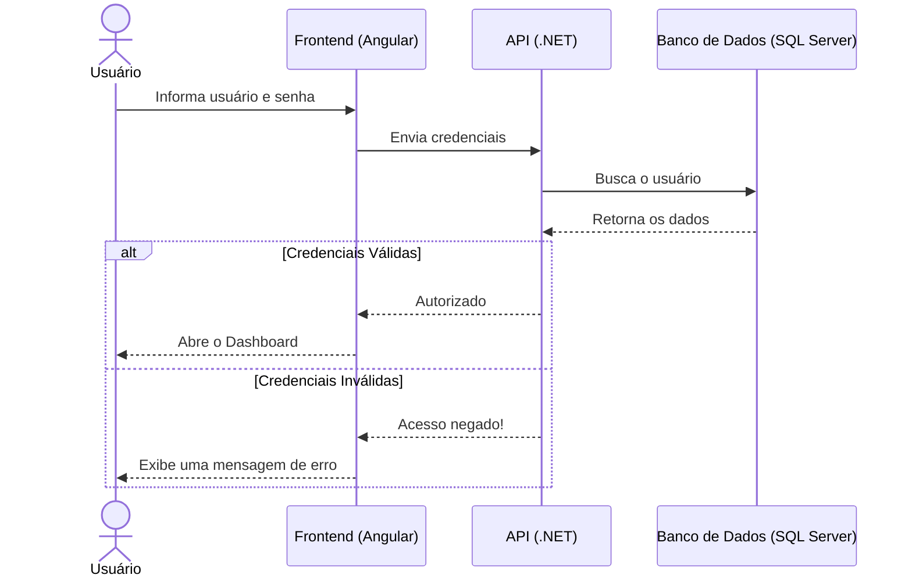

# Diagrama de Sequência - Login

```mermaid
sequenceDiagram
actor U as Usuário
participant F as Frontend (Angular)
participant A as API (.NET)
participant B as Banco de Dados (SQL Server)

U->>F: Informa usuário e senha
F->>A: Envia credenciais
A->>B: Busca o usuário
B-->>A: Retorna os dados
alt Credenciais Válidas
    A-->>F: Autorizado
    F-->>U: Abre o Dashboard
else Credenciais Inválidas
    A-->>F: Acesso negado!
    F-->>U: Exibe uma mensagem de erro

end

```
